# README

## 代码位置

代码包是一个springboot项目，**后端代码在java包中，前端代码在resources的static包中**。

（ps: 建议使用**IDEA**打开project。如果需要查看前端源码，推荐使用**vscode**打开static包。)

## 实现方案

- 假定TACO为主题做了一个主页，界面右上角有 ***注册*** 和 ***登录*** 两个按钮，点击注册按钮出现**register弹窗**，点击登录按钮出现**login弹窗**，每一个弹窗都有**logo标识**。

  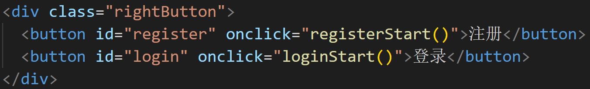

- register弹窗里分为以下几点：**Email、Phone、Usename、Password、email验证码、第三方登录**

  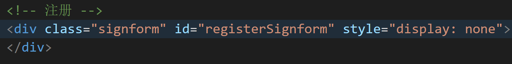

- login弹窗里分为**Email、Password、算术验证码、记住密码（默认勾选）、忘记密码、第三方登录**

  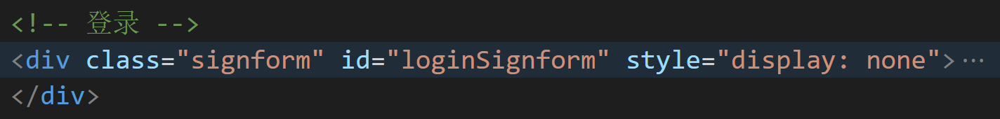

- **忘记密码**点击后会出现新的弹窗，用户通过email来修改新密码。

  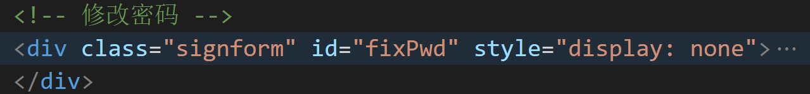

- 登录和注册都提供**第三方登录**的选项，但具体功能尚未实现，仅为前端实现。

  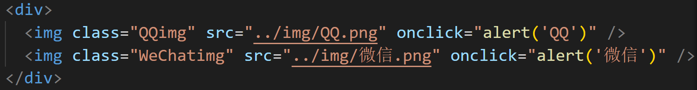

- Springboot实现**邮箱发送验证码**

  - 备注：**springboot的application中邮箱的pwd**出于安全考虑被我**隐藏**了，所以助教拿到的源码应该发不了邮件（^v^)
  
  
  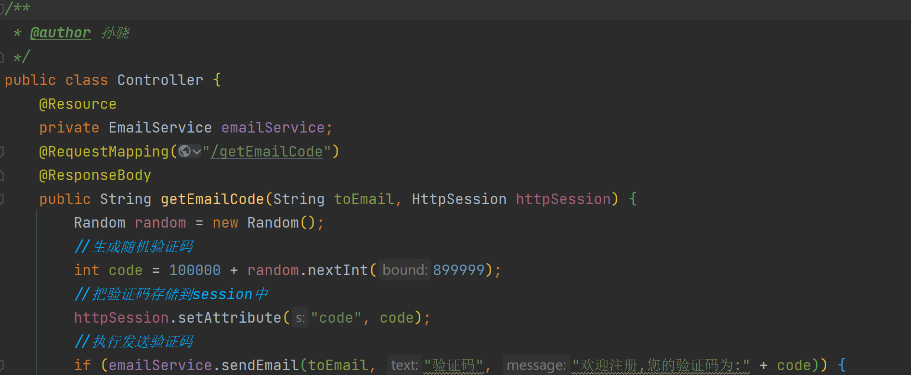
  
- 注册和忘记密码中都对**新密码**提供了**强度检验**的功能。

  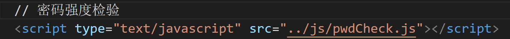
  
- 前端发送邮箱地址给后端、前端比对验证码

  
  
  

## 安装  

### 前端

nodejs

jQuery

axios

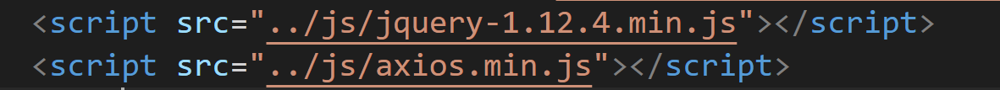

### 后端

springboot

## 截图

### 直接查看

 [login&register.html](project\src\main\resources\static\html\login&register.html) 

### 主页

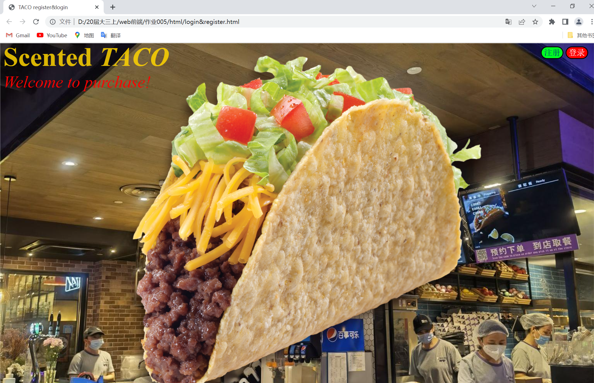

### 注册

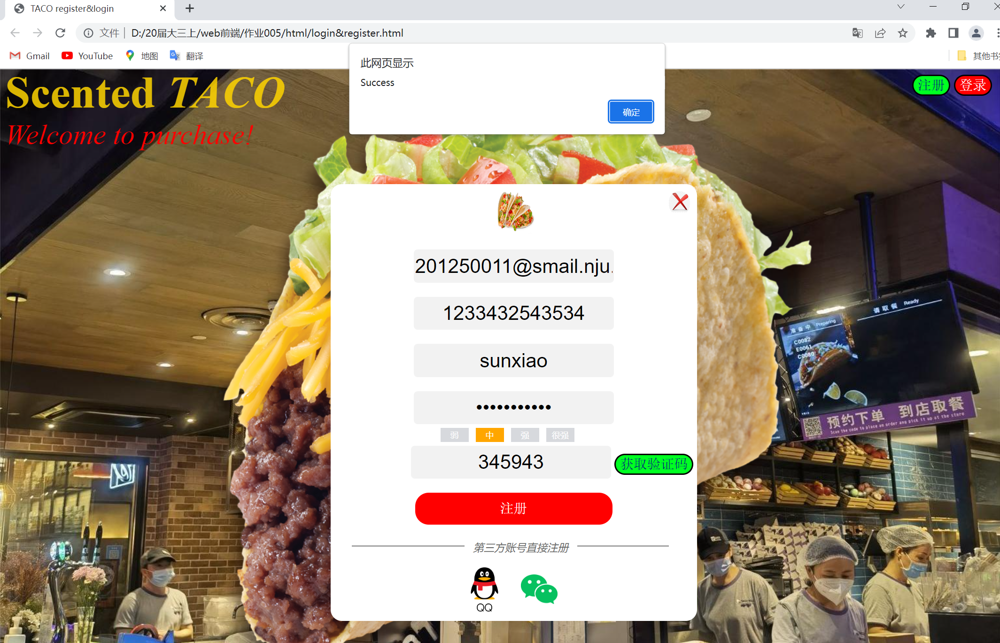

### 登录

#### 	登录成功后会跳转二级页面

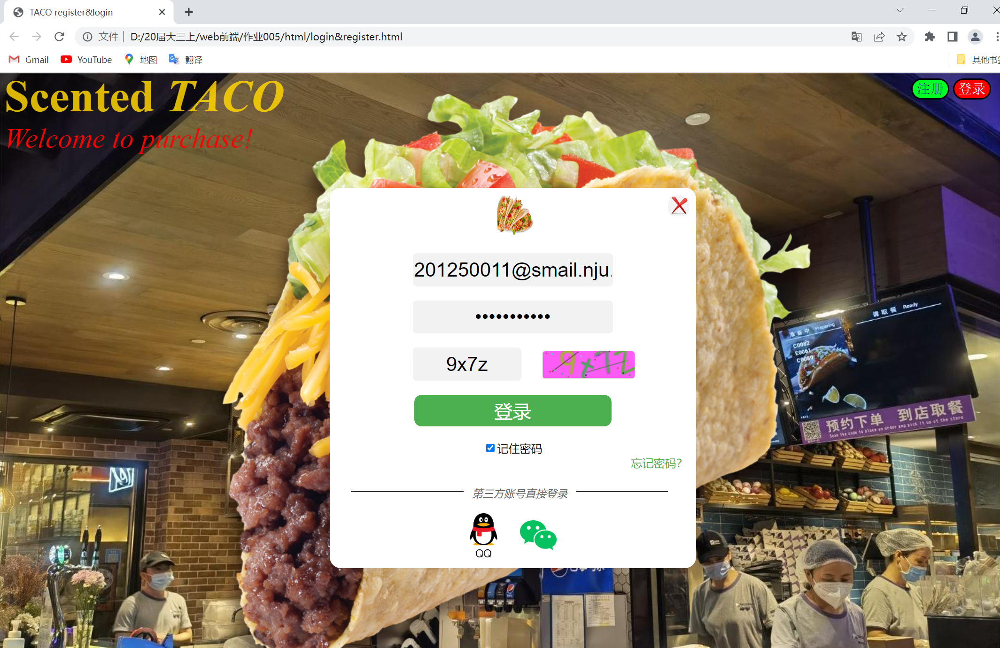

### 二级页面

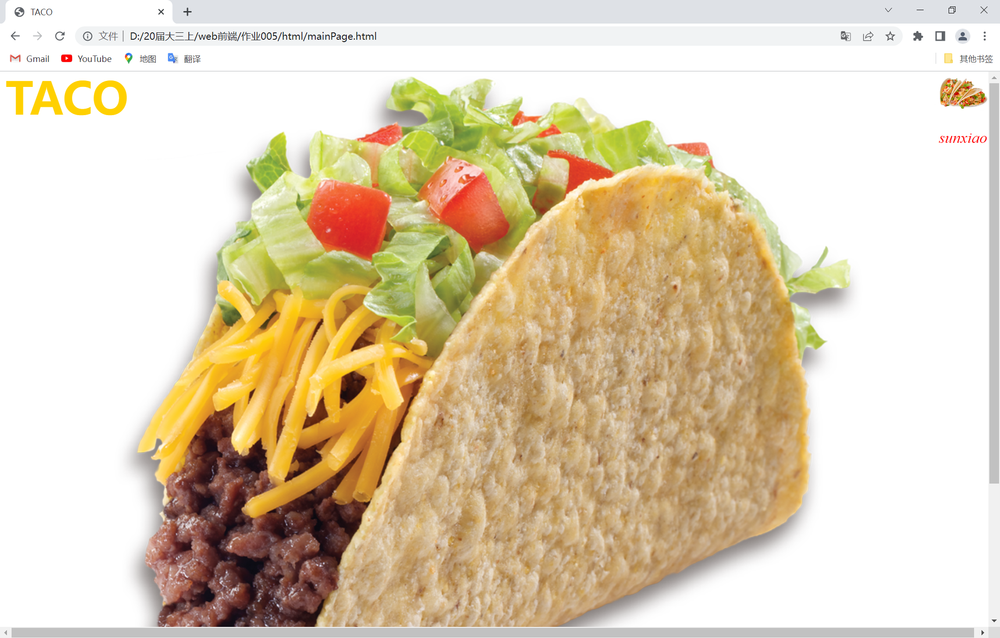

### 忘记密码

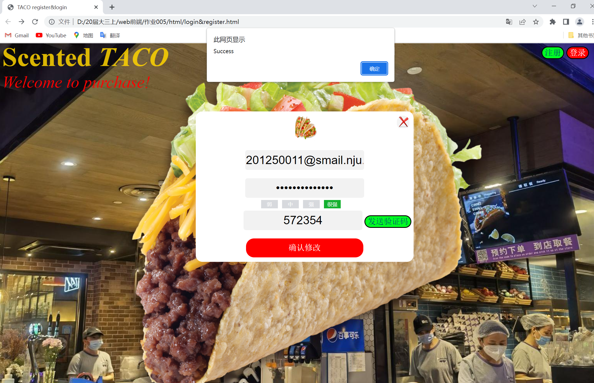

### 第三方

####  	QQ

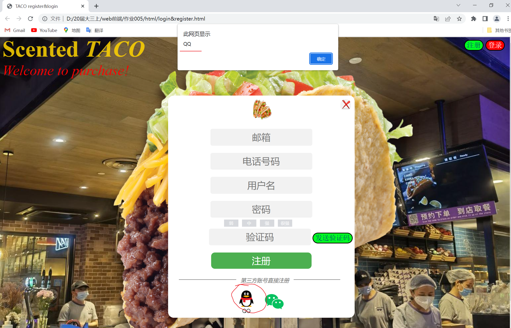

#### 	微信

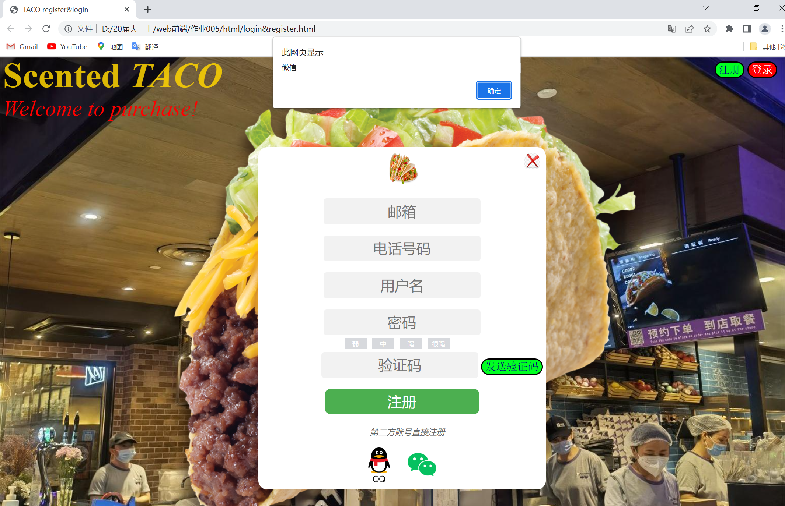

## 参考文献

1. W3C https://www.w3schools.com/
2. jQuery https://releases.jquery.com/
3. axios https://www.cdnpkg.com/axios/file/axios.min.js/
4. 前后端数据交互 https://blog.csdn.net/weixin_43005654/article/details/123568085
5. JavaMailSender https://blog.csdn.net/weixin_44635157/article/details/120563990
6. 前端生成验证码 https://blog.csdn.net/qq_43466457/article/details/100559974
7. 邮件发送验证码 https://blog.csdn.net/lx960927/article/details/107049353
8. 密码强度 https://blog.csdn.net/sirlll/article/details/123323092
9. 弹窗式登录注册框 https://www.cnblogs.com/liujianhuaIT/p/6256261.html
10. 文字两边添加水平线 https://blog.csdn.net/qq_33833327/article/details/78651948

